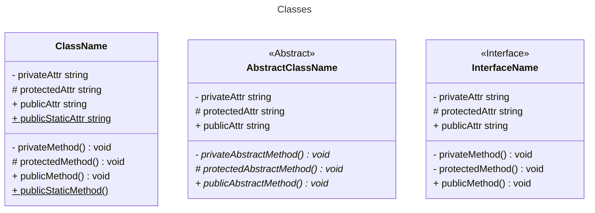
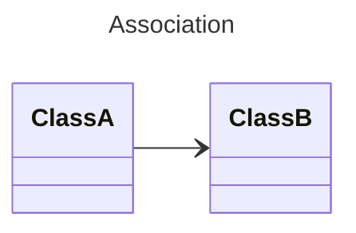
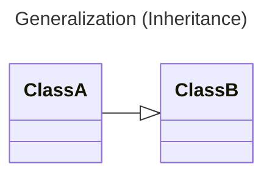
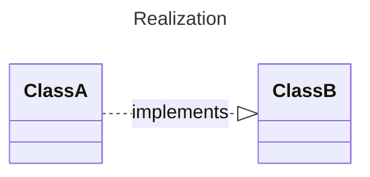
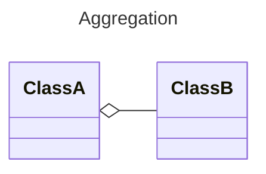
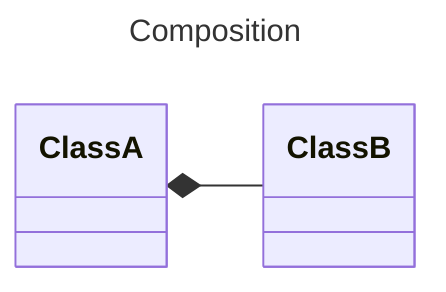

# Basics

## Classes diagrams

### Classes



### Relationships
#### Association
ClassA depends on ClassB



#### Generalization (Inheritance)
ClassA inherits from ClassB


#### Realization
ClassA implements ClassB


#### Aggregation
ClassB add funcionalities to ClassA, but ClassA is not strongly bond to ClassB
```typescript
class ClassA {
  method(b: ClassB) {
    //method body
  }
}
```

#### Composition
ClassB add funcionalities to ClassA, and ClassA is strongly bond to ClassB. If ClassA no longer exists, ClassB won't exist either.
```typescript
class ClassA {
  method(b: ClassB) {
    //method body
  }
}
```

