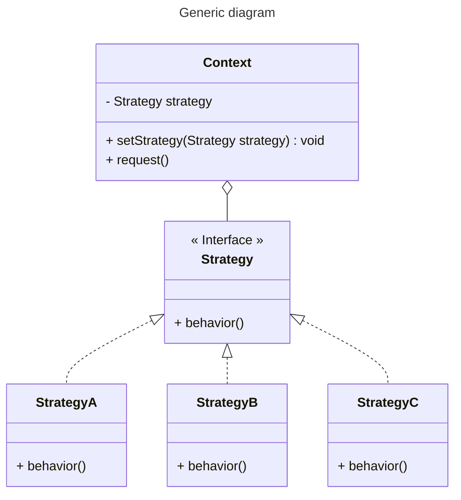

# Strategy

- What: it creates a family of algorithms that can be exchanged, that is, using one family member in place of another, depending on the needs of those who use them.
- When: many classes do the same thing in different ways.
- Cons: when the family of algorithms is to big, communication costs can be a problem.

## Generic diagram



## Problem - Shipping calculation

### Execute

```bash
$ npm test -- behavioral/strategy
```

### Class diagram

The orders of each sector (eletronics, furniture, etc) can have different shipping calculations (shipping family: common, express, etc)

```mermaid
---
title: Problem - Shipping calculation
---
classDiagram
direction TB
    class Order {
	    - float value
	    - Shipping shipping
	    + getValue() float
	    + setValue(float value) void
	    + setShipping(Shipping shipping) void
	    + calculateShipping() float
    }
    class OrderEletronics {
	    - string sector
	    + getSector() string
	    + setSector(string sector) void
    }
    class OrderFurniture {
	    - string sector
	    + getSector() string
	    + setSector(string sector) void
    }
    class Shipping {
	    + calculate(float value) float
    }
    class ShippingCommon {
	    + calculate(float value) float
    }
    class ShippingExpress {
	    + calculate(float value) float
    }
	<<Abstract>> Order
	<<Interface>> Shipping
    Order <|-- OrderEletronics
    Order <|-- OrderFurniture
    Shipping <|.. ShippingCommon
    Shipping <|.. ShippingExpress
    Order o-- Shipping

```


