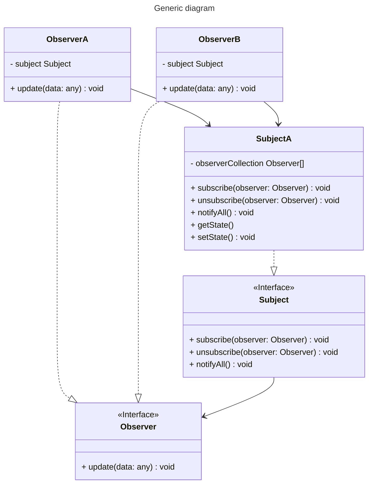
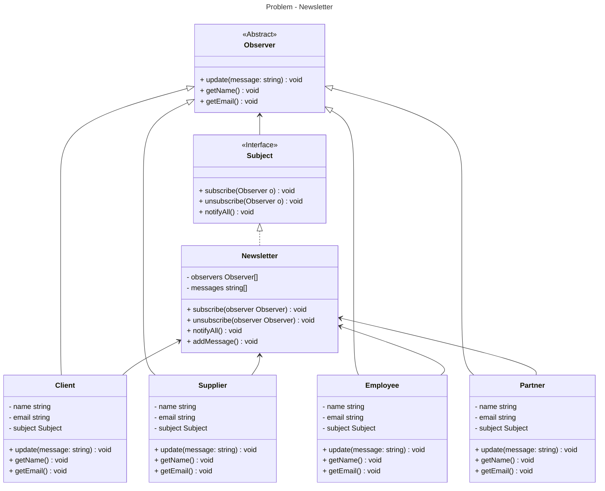

# Strategy

- What: defines a dependency one-to-many between objects, so that when an object changes its state, all its dependents are notified and updated automatically
- When: when there's many objects expecting changes from another object and there's no control of how many objects need to be updated.
- Cons: can cause unexpected side effects

## Generic diagram



## Problem - Newsletter

### Class diagram



### Tests

#### Unit and integration tests

```bash
$ npm run test:pattern behavioral/observer
```

#### Mutation test

```bash
$ npm run test:mutation:pattern behavioral/observer
```
