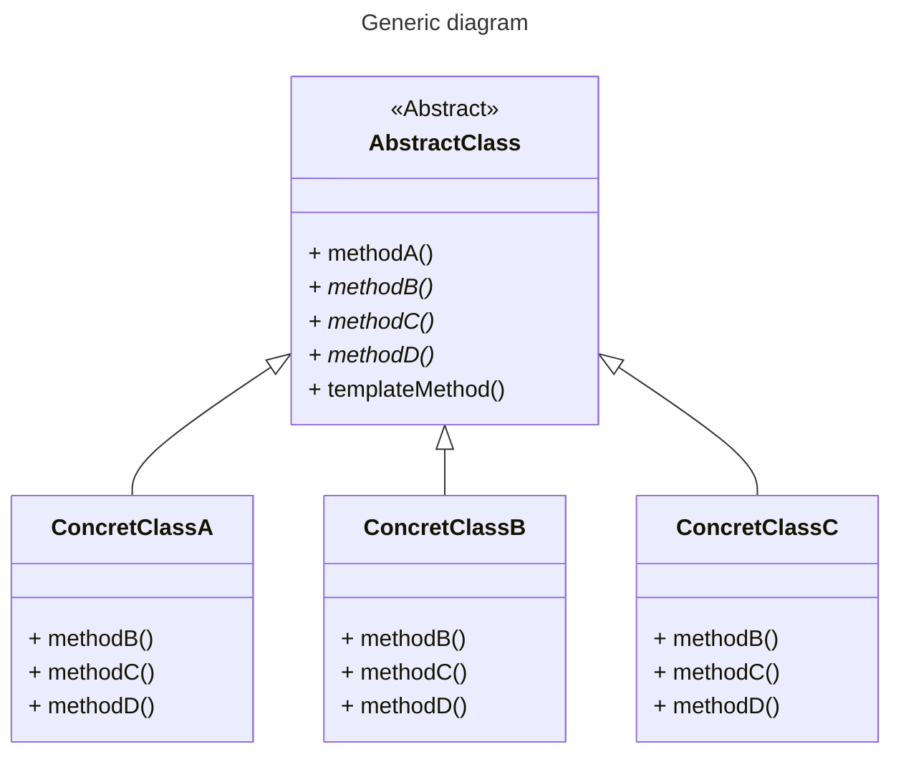
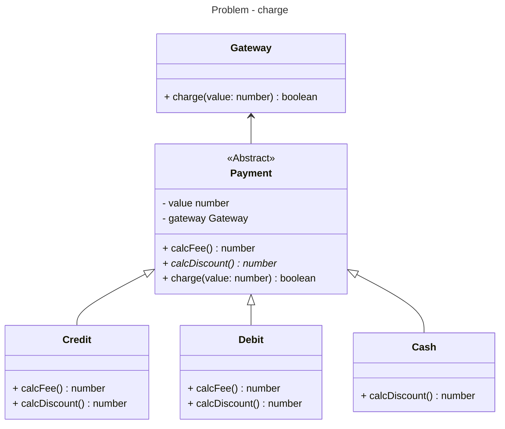

# Template method

- What: defines an skeleton of an algorithm inside a method, transfering some of its steps to subclasses. Avoids duplication between similar classes.
- When: there is a set of classes executing the same steps but with different behavior for each one
- Cons: if there is too much abstract methods, creating new subclasses becomes too complex

## Generic diagram



## Problem - Charge

### Execute

```bash
$ npm run test:patterns:unit -- behavioral/template-method
```

### Class diagram

The payments of each type (Debit, Credit, Cash) can have a default behaviour for fee calculation or have its own calculation. Each type have to implement its own discount calculation. All types have the save behaviour for charging.


