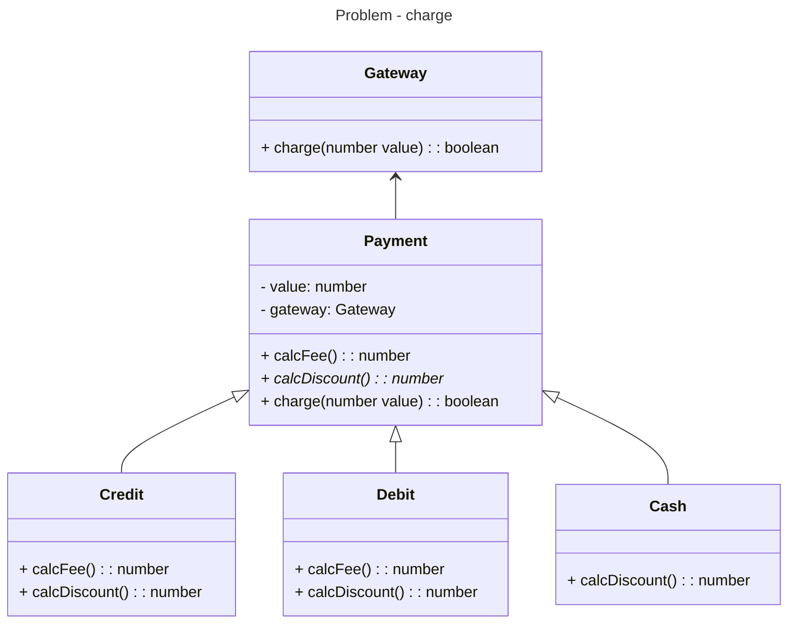

# Template method

- What: defines an skeleton of an algorithm inside a method, transfering some of its steps to subclasses. Avoids duplication between similar classes.
- When: there is a set of classes executing the same steps but with different behavior for each one
- Cons: if there is too much abstract classes, creating new subclasses becomes to completed

## Generic diagram

```mermaid
---
title: Generic diagram
---
classDiagram
direction TB

class AbstractClass* {
  + methodA()
  + methodB()*
  + methodC()*
  + methodD()*
  + templateMethod()
}

class ConcretClassA {
  + methodB()
  + methodC()
  + methodD()
}

class ConcretClassB {
  + methodB()
  + methodC()
  + methodD()
}

class ConcretClassC {
  + methodB()
  + methodC()
  + methodD()
}

AbstractClass <|-- ConcretClassA
AbstractClass <|-- ConcretClassB
AbstractClass <|-- ConcretClassC

```

## Problem - Charge

### Execute

```bash
$ npm test -- behavioral/template-method
```

### Class diagram

Blablabla


