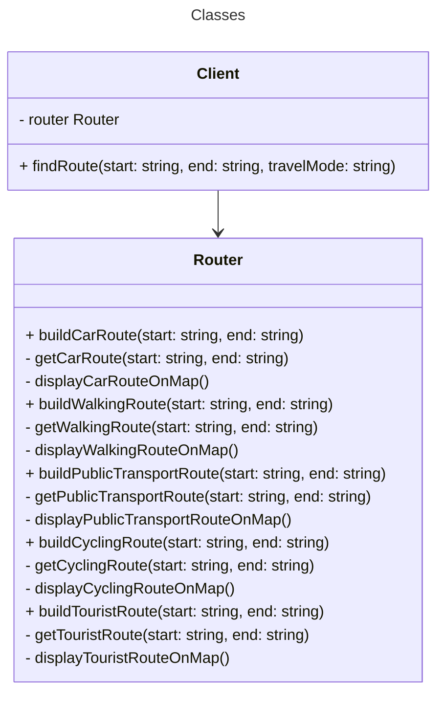

# Code w/ problem: Casual traveler

A navigation application for casual travelers, centered around a beautiful map that helps people quickly orient themselves in any city. The app allows for an address to be entered, displaying the fastest route to that destination on the map. It can build routes for roads, walking, public transportation, cycling, and tourist attractions.

## Class diagram



## Execute

```bash
$ npm run execute:problem casual-travelers
```

## Tests

### Unit and integration tests

```bash
$ npm run test:problem casual-travelers
```

### Mutation test

```bash
$ npm run test:mutation:problem casual-travelers
```
