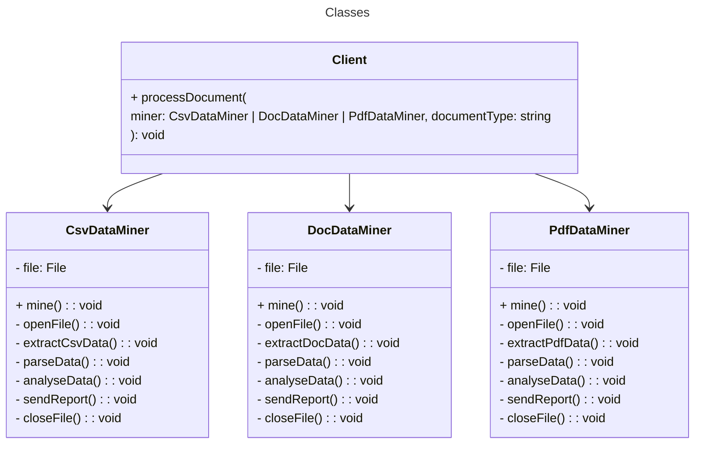

# Code w/ problem: Data miner

A data mining application designed to analyze corporate documents. The system processes documents in various formats, such as PDF, DOC, and CSV, and aims to extract and standardize the data into a uniform output.

## Class diagram



## Execute

```bash
$ npm run execute:problem data-miner
```

## Tests

### Unit and integration tests

```bash
$ npm run test:problem data-miner
```

### Mutation test

```bash
$ npm run test:mutation:problem data-miner
```
