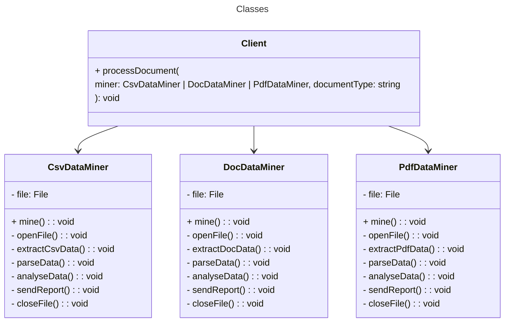

```mermaid
---
title: Classes
---
classDiagram
direction TB

class Client {
  + processDocument(
    miner: CsvDataMiner | DocDataMiner | PdfDataMiner, documentType: string
    ): void
}

class CsvDataMiner {
  - file: File
  + mine(): void
  - openFile(): void
  - extractCsvData(): void
  - parseData(): void
  - analyseData(): void
  - sendReport(): void
  - closeFile(): void
}

class DocDataMiner {
  - file: File
  + mine(): void
  - openFile(): void
  - extractDocData(): void
  - parseData(): void
  - analyseData(): void
  - sendReport(): void
  - closeFile(): void
}

class PdfDataMiner {
  - file: File
  + mine(): void
  - openFile(): void
  - extractPdfData(): void
  - parseData(): void
  - analyseData(): void
  - sendReport(): void
  - closeFile(): void
}

Client --> CsvDataMiner
Client --> DocDataMiner
Client --> PdfDataMiner

```
