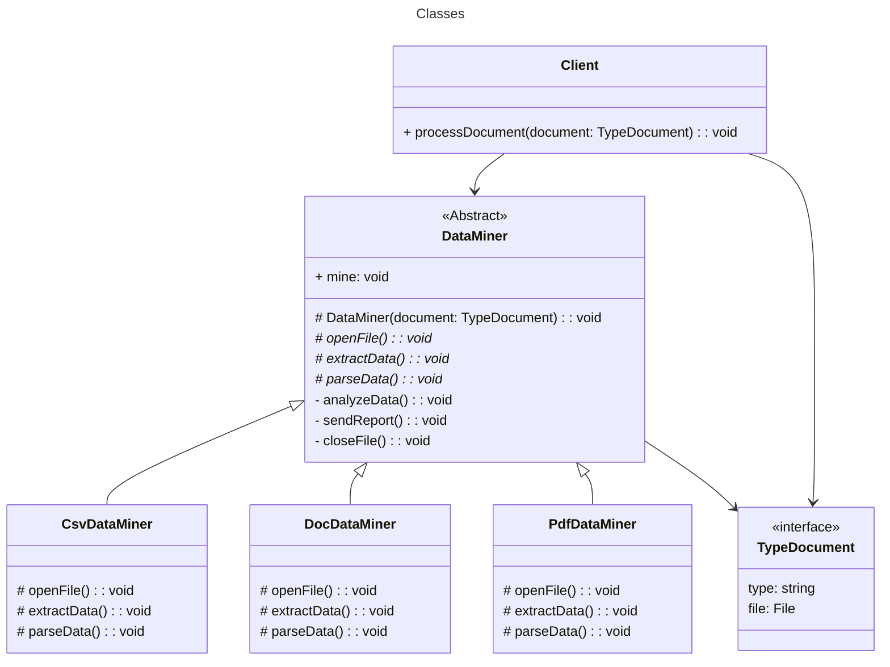

# Solved: Data miner

## Execute

```bash
$ npm run execute:solved data-miner
```

## Class diagram


```mermaid
---
title: Classes
---
classDiagram
direction TB

class Client {
  + processDocument(document: TypeDocument): void
}

class TypeDocument {
  <<interface>>
  type: string
  file: File
}

class DataMiner {
  <<Abstract>>
  # DataMiner(document: TypeDocument): void
  + mine: void
  # openFile()*: void
  # extractData()*: void
  # parseData()*: void
  - analyzeData(): void
  - sendReport(): void
  - closeFile(): void
}

class CsvDataMiner {
  # openFile(): void
  # extractData(): void
  # parseData(): void
}

class DocDataMiner {
  # openFile(): void
  # extractData(): void
  # parseData(): void
}

class PdfDataMiner {
  # openFile(): void
  # extractData(): void
  # parseData(): void
}

Client --> DataMiner
Client --> TypeDocument
DataMiner <|-- CsvDataMiner
DataMiner <|-- DocDataMiner
DataMiner <|-- PdfDataMiner
DataMiner --> TypeDocument

```
