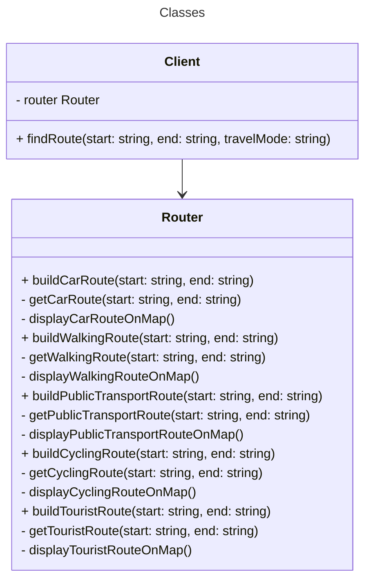

# Code w/ problem: News agency

This application delivers news using a checking approach. A central source holds news headlines. Customers, such as a news app or a website, get these stories. To manage delivery, the app lets customers sign up to receive news from the source. The app also allows customers to stop their subscription.

## Execute

```bash
$ npm run execute:problem news-agency
```

## Class diagram


