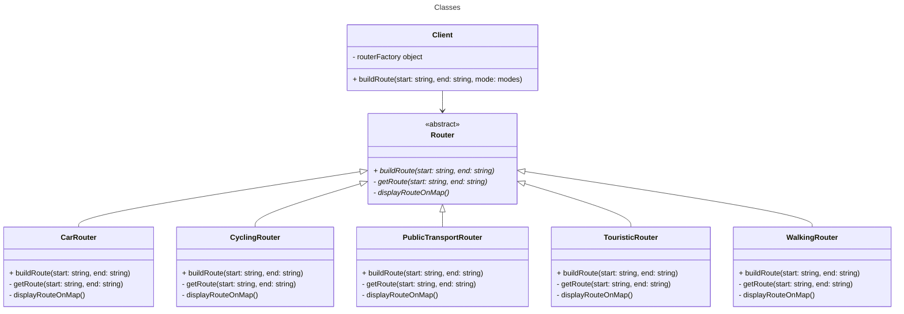

# Solved: Casual traveler

## Execute

```bash
$ npm run execute:solved news-agency
```

## Class diagram


```mermaid
---
title: Classes
---
classDiagram
direction TB

class Client {
  - routerFactory object
  + buildRoute(start: string, end: string, mode: modes)
}

class Router {
  <<abstract>>
 + buildRoute(start: string, end: string)*
 - getRoute(start: string, end: string)*
 - displayRouteOnMap()*
}

class CarRouter {
  + buildRoute(start: string, end: string)
  - getRoute(start: string, end: string)
  - displayRouteOnMap()
}

class CyclingRouter {
  + buildRoute(start: string, end: string)
  - getRoute(start: string, end: string)
  - displayRouteOnMap()
}

class PublicTransportRouter {
  + buildRoute(start: string, end: string)
  - getRoute(start: string, end: string)
  - displayRouteOnMap()
}

class TouristicRouter {
  + buildRoute(start: string, end: string)
  - getRoute(start: string, end: string)
  - displayRouteOnMap()
}

class WalkingRouter {
  + buildRoute(start: string, end: string)
  - getRoute(start: string, end: string)
  - displayRouteOnMap()
}

Client --> Router
Router <|-- CarRouter
Router <|-- CyclingRouter
Router <|-- PublicTransportRouter
Router <|-- TouristicRouter
Router <|-- WalkingRouter
```
